# Práctica 2.2 – Autenticación en Nginx

### Jaime Grueso Martin

## Indice
1. [Requisitos Indispensables Previos Al Comienzo de la Práctica](#id1)
2. [Introducción](#id2)
3. [Paquetes Necesarios](#id3)
4. [Creación de Usuarios y Contraseñas para el Acceso Web](#id4)
5. [Configurando el Servidor Nginx para Usar Autenticación Básica](#id5)
6. [Probando la Nueva Configuración](#id6)
    1. [Tareas](#id61)
    2. [Combinación de la Autenticación Básica con la Restricción de Acceso por IP](#id62)
7. [Tareas](#id7)
8. [Cuestiones Finales](#id8)
    1. [Cuestion 1](#id81)
    1. [Cuestion 2](#id82)
    1. [Cuestion 3](#id83)
    1. [Cuestion 4](#id84)


<div id='id1'></div>

## Requisitos Indispensables Previos Al Comienzo de la Práctica
Es importante que la práctica anterior esté funcionando correctamente y se hayan hecho las comprobaciones
necesarias.

<div id='id2'></div>

## Introducción
En una transacción HTTP, la autenticación básica es un método que permite a un navegador web u otro cliente enviar credenciales, como nombre de usuario y contraseña, cuando solicita una página al servidor. Esta forma de autenticación es la más simple para aplicaciones web. No destaca por su seguridad o sofisticación. No requiere el uso de cookies, identificadores de sesión ni páginas de inicio de sesión.

<div id='id3'></div>

## Paquetes Necesarios
Se utilizará la herramienta Openssl para crear las contraseñas. Se instalará en caso de no tenerlo instalado.
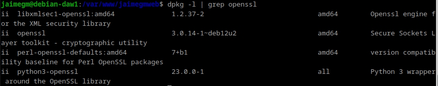

<div id='id4'></div>

## Creación de Usuarios y Contraseñas para el Acceso Web
Se creará un usuario con el nombre del usuario y otro con el apellido del mismo. Para ello se creará un archivo oculto
llamado `.htpasswd`. Aquí se guardarán los usuarios y contraseñas.

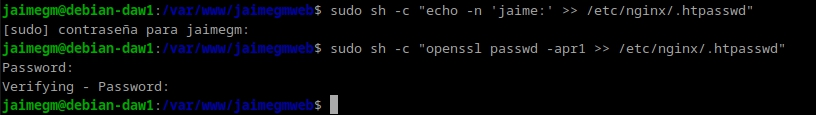

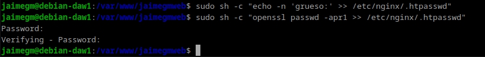

Las contraseñas deberán aparecer cifrads cuando se abra el archivo.

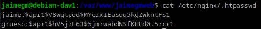

<div id='id5'></div>

## Configurando el Servidor Nginx para Usar Autenticación Básica
Se cambiará la configuración del server block sobre el cual queremos aplicar la restricción de acceso.

`sudo nano /etc/nginx/sites-available/nombre_web`

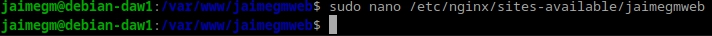

Nginx permite añadir restricciones a nivel de servidor o en un location. Se protegerá el documento raiz de la web.

Se utilizará `auth_basic` dentro del location y se pondrá un nombre a lo que se mostrará. Se configurará Nginx para que utilice el fichero previamente creado con `auth_basic_user_file`.

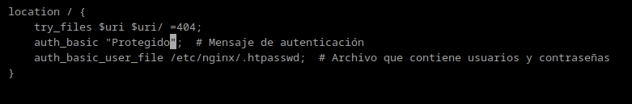

Se reiniciarán los servicios de Nginx para que se apliquen los cambios
hechos hasta ahora.

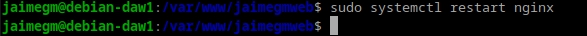

<div id='id6'></div>

## Probando la Nueva Configuración

Si se han seguido los pasos, se podrá visualizar una ventana requiriendo
el usuario y la contraseña que se ha configurado previamente.

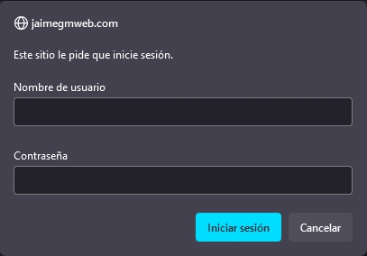

Si se decide cancelar la autenticación se mostrará una ventana con el siguiente error:

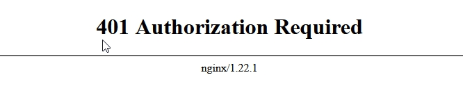

Una vez autenticados, la informacion se guardará en el navegador y no se volverá a requerir de los datos de autenticación.

<div id='id61'></div>

### Tareas

Se realizará una prueba que consiste en intentar entrar en la página web con un usuario erróneo y después con uno de verdad. Esto quedará registrado en los logs. Se va a intentar entrar con el usuario "manolo"

Aqui se puede ver que se ha intentado acceder con el usuario "manolo" y ha quedado registrado en el archivo `access.log` y `error.log`. Cuando se ha intentado entrar con un usuario registrado, no se aprecia ningún error.

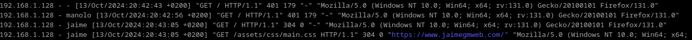

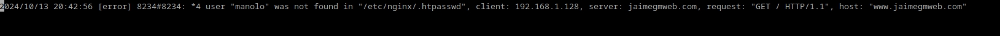

La siguiente tarea consiste en solo aplicar la restricción a una sola parte de la web. Se aplicará a la sección "Contact". Para ello se deberá modificar el archivo `/etc/nginx/sites-available/nombre_web`.

Debido a que la web no tiene ficheros divididos para cada sección es imposible proteger una única sección porque Nginx no puede aplicar la autenticación directamente a los fragmentos de URL que están después del símbolo #, como #contact. Estos fragmentos son procesados únicamente por el navegador y no son enviados al servidor. Por ello se ha decidido hacer un archivo HTML, pero solo con la parte `Contact`. 

Para aplicar la proteción se ha de modificar el archivo de configuración.

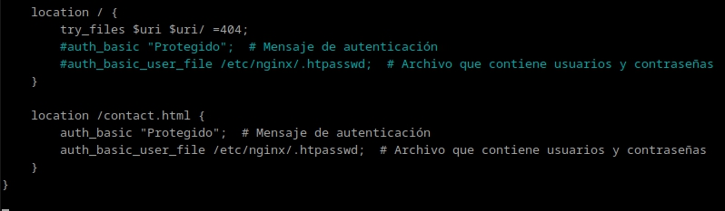

Y una vez hecho esto, la página web a la que se accede sigue siendo la misma, solo que ninguno de los botones a excepción de "Contacto" funcionan. Al entrar ahora en la web `https://www.jaimegmweb.com/contact.html` se solicitarán las credeciales necesarias.

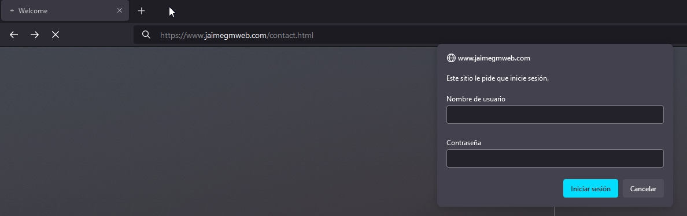


<div id='id62'></div>

### Combinación de la Autenticación Básica con la Restricción de Acceso por IP

La autenticación básica HTTP será combinada con la restricción de acceso por IP:

Un usuario es autenticado y tendrá una IP.
Un usuario es autenticado o tendrá una IP.

<div id='id7'></div>

## Tareas
Se configurará Nginx para que la IP de la maquina física no tenga acceso a la raiz de la web. Para ello se modificará el archivo de configuracion.

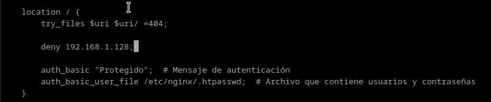

Al intentar acceder, el navegador nos mostrará la siguinte pantalla:

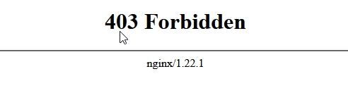

Y si se mira el archivo error.log, aparecerá el un error que indica que se ha prohibido el acceso.

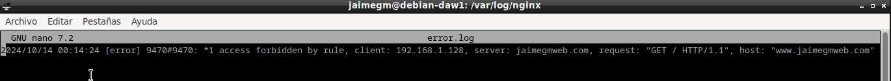

Ahora se hará lo contrario, se tendrá un ususario válido y una IP válida. Se modificará el archivo de configuración como previamente se ha hecho.

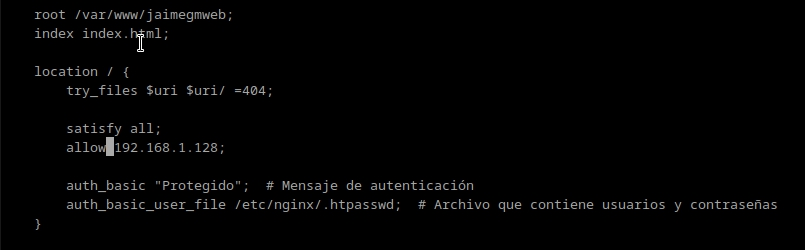

Al intentar entrar en la web, no se pone ningún tipo de impedimento.


<div id='id8'></div>

## Cuestiones Finales

<div id='id81'></div>

### Cuestión 1
No se podrá acceder porque, aunque la IP está permitida, la directiva `satisfy all`; requiere cumplir tanto la validación de IP como la autenticación básica. Si se ingresa erroneamente el usuario o la contraseña, fallas en la autenticación, por lo que el acceso será denegado.

<div id='id82'></div>

### Cuestión 2
No se podrá acceder porque la regla `deny all`; bloquea todas las IPs antes de llegar a la excepción que permite la IP. Aunque se introduzca el usuario y la contraseña correctamente, la directiva `deny all`; se evalúa primero, bloqueando el acceso antes de verificar si la IP está permitida.

<div id='id83'></div>

### Cuestión 3
No se podrá acceder porque, aunque la directiva `satisfy any` permite el acceso si se cumple cualquiera de las condiciones la IP está bloqueada con la regla `deny`. Aunque se ingresee correctamente el usuario y la contraseña, la denegación de tu IP impide el acceso.

<div id='id84'></div>

### Cuestión 4
````
location /Proyectos {
    try_files $uri $uri/ =404;  # Devuelve un error 404

    auth_basic "Acceso Restringido";  # Mensaje de autenticación
    auth_basic_user_file /etc/nginx/.htpasswd;
}
````


